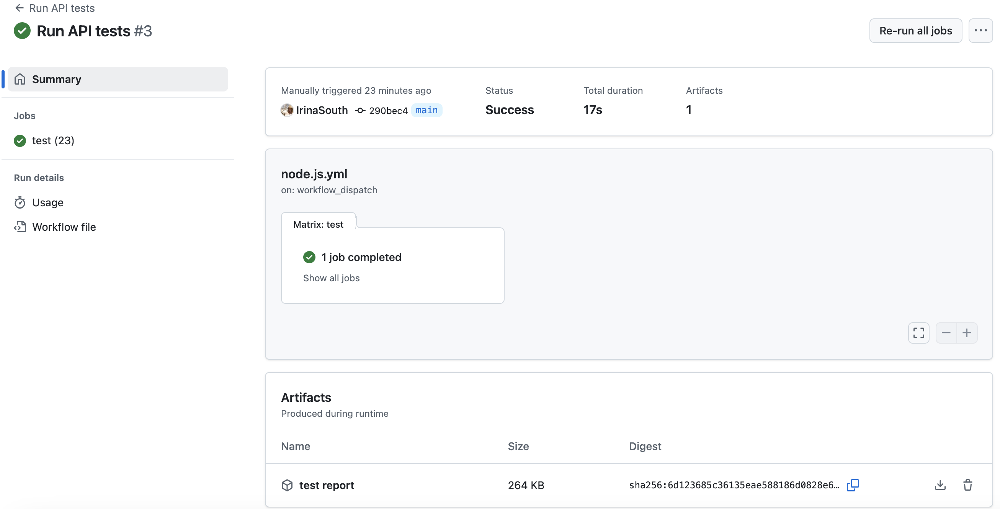

# cucumber-js-axios-api-test
Example API test with Cucumber JS, Axios and Chai

Example API test to demonstrate the use of automated testing with Javascript, Cucumber JS, Axios (REST client) and Chai (assertion library) 

To run the test locally: 

`npm install` to install dependencies

`npm test` to run tests

You can find cucumber-report.html file generated containing test results.   

To execute the test with GitHub actions:

Select Actions menu -> select Run API Tests -> from the drop-down menu select Run Workflow. You can download and view the html report from the Artifacts sections

### Why Cucumber? 

Cucumber.js is a test framework with clear, human-readable syntax and focus on behavior-driven development (BDD). Cucumber allows to write test scenarios using simple language (Gherkin) that anyone on the team, e.g developers, BA's, or testers can understand easily. Steps can be easily reused to save effort and reduce repetition.

This particular example demonstrates the use of a Cucumber data table and parametrised test steps.

### Challenges?

1) Making sure we are using async/await in the step when API call is made - as this is asynchronous operation.

2) Using a code block to convert "true/false" strings into true/false boolean values, this is due to the fact that when passing data from cucumber js, it is treated as strings.

### Improvements? 

In the future as the number of tests increase, I would recommend to use config files and/or env. variables. Those could be useful to store constants like baseUrls. 
Use world.js with a shared context object that exists for the duration of a scenario. It lets you attach and access data between steps.  

